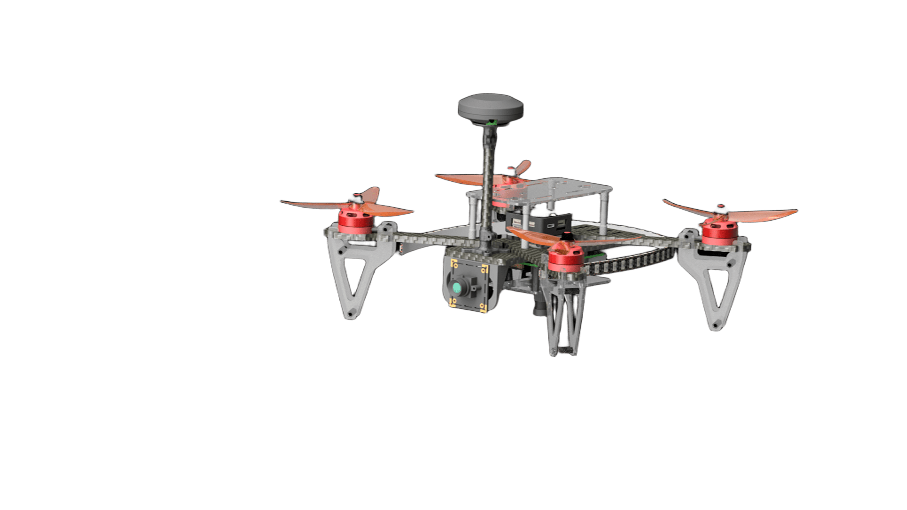

# Eurus-Edu

**Eurus-Edu** - это учебный конструктор программируемого квадрокоптера, состоящего из популярных открытых компонентов, 
а также набор необходимой документации и библиотек для грамотной работы с ним. 

Набор включает в себя полётный контроллер с полётным стеком, [Orange Pi 5](orangepi_info.md) в качестве управляющего бортового компьютера 
на базе восьмиядерного процессора Rockchip RK3588S, модуль камеры для реализации полётов с использованием компьютерного зрения, 
а также набор различных датчиков и другой периферии.

Платформа Eurus-Edu включает в себя преднастроенный [образ для Orange Pi 5](orangepi_image.md) с полным набором необходимого ПО для работы со всей периферией. 
Исходный код платформы Eurus-Edu и данной документации [открыт и доступен на GitHub](https://github.com/EurusAero/eurus_edu).
