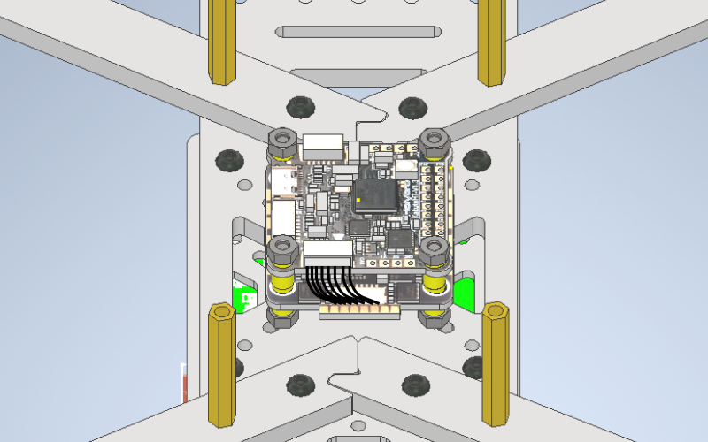

# Сборка

- [Сборка рамы](#1)
- [Установка моторов](#2)
- [Сборка ножек](#3)
- [Сборка и установка полётного контроллера (FC) и регулятора оборотов (ESC)](#4)
- [Установка приёмника](#5)
- [Установка Orange Pi 5](#6)
- [Установка Optical Flow](#7)
- [Установка понижающего преобразователя](#8)
- [Установка камеры](#9)
- [Установка светодиодной ленты](#10)
- [Сборка защиты](#11)

### Перечень крепежа

| Название                     | Количество (шт) |
| ---------------------------- | --------------- |
| Винт M3x6                    | 24              |
| Винт M3x6 (НЕX)              | 14              |
| Винт M3x8 (НЕX)              | 36              |
| Винт M3x12                   | 4               |
| Винт M3x14 (НЕX)             | 8               |
| Винт M3x25                   | 4               |
| Гайка M3                     | 12              |
| Гайка нейлоновая M3          | 10              |
| Стойка металлическая 10мм    | 4               |
| Стойка нейлоновая 5мм + 6мм  | 6               |
| Стойка нейлоновая 10мм + 6мм | 4               |
| Стойка нейлоновая 15мм       | 12              |
| Стойка нейлоновая 20мм       | 4               |
| Стойка нейлоновая 40мм       | 12              |
| Стойка металлическая 30мм    | 4               |

## Сборка рамы {#1}

1\. Соединяем 4 луча с центарльной декой, на центральных отверстиях закрепляем четрырьмя винтами M3x14 (HEX) и металлическими гайками M3, на крайних отверстиях металлическими стойками 30мм, фиксируя винтами M3x14 (HEX)

2\. На нижней части центральной платформы установите металлические стойки 10мм закрепляя винтами M3x8 (НЕX)

## Установка моторов {#2}

1\. Устанавливаем моторы на соответствующие отверстия в луче при помощи винтов M3x6 (HEX), которые идут в комплекте с моторами.

_Убедитесь, что винты не касаются мотора._

## Сборка ножек {#3}

1\. Закрепите нейлоновые стойки 15мм на одну из половин ножки, используя винт M3x6

2\. Установите получившуюся конструкцию на луч дрона, закрепляя винтами M3x6 со второй частью.

## Сборка и установка полётного контроллера (FC) и регулятора оборотов (ESC) {#4}

1\. На центральную раму устанавливаем 4 винта M3x25, закрепляя гайками M3 (посмотрите размеры монтажных отверстий на регуляторе оборотов. Не затягивайте гайки плотно, чтобы была возможность регулировки винтов)

2\. На гайки устанавливаем ESC, предварительно надев на него демпферные резинки. Припаиваем к нему моторы

3\. Припаиваем моторы, как показано на схеме. Закрепляем провода моторов изолентой вокруг луча.

4\. Устанавливаем полётный контроллер, предварительно надев на него демпферные резинки. Закрепляем нейлоновыми гайками M3

5\. Соедините полётный контроллер с регулятором оборотов комплектным шлейфом как показано на схеме

 Не забудьте вставить MicroSD карту, отформатированную в формат FAT32 

## Установка приёмника {#5}

1\. Припаять провода к приёмнику и полётному контроллеру по указанной схеме. Длина проводов - 9см. Затем прикрепить к приёмнику антенну и усадить его в термоусадку.

2\. После подключения проводов, приёмник в термоусадке приклеить на двусторонний скотч как показано на схеме. Антенну закрепить с помощью двух стяжек крест-накрест под лучом.

## Установка Orange Pi 5 {#6}

1\. На нижнюю платформу для Orange Pi установите нейлоновые стойки M3(5мм + 6мм) и закрепите винтами M3x6 (НЕX)

2\. Закрепите полученную платформу на стойки, установленные на втором этапе, винтами M3x6 (НЕX)

3\. Закрепите Orange Pi нейлоновыми стойками по 20мм

4\. Подключите полётный контроллер к usb-порту Orange Pi

Провод пропустите через заднюю левую ножку

5\. Прикрепляем нейлоновые стойки к нижней пластине, закрепляя их винтами M3x6 (НЕX)

6\. Устанавливаем нижнюю пластину, крепим к нейлоновым стойкам на винты M3x8 (HEX)

## Установка Optical Flow {#7}

1\. На крайние стойки нижней пластины устанавливаем OpticalFlow, закрепляя нейлоновыми гайками.

2\. Припаиваем OpticalFlow как показано на схеме

## Установка понижающего преобразователя {#8}

1\. Входные провода красного и синего цвета нужно припаять на основное питание с регулятора оборотов, как показано на схеме

2\. Выходные контакты с понижающего преобразователя должны быть подключены к одноплатному компьютеру, как показано на схеме

_Убедитесь, что контакты подключены к нужным разъёмам одноплатного компьютера!_

3\. Закрепляем понижающий преобразователь с припаянными проводами, как показано на схеме.

## Установка камеры {#9}

1\. Установите камеру на оставшиеся стойки нижней панели, закрепите нейлоновыми гайками. Подключите камеру к одноплатному компьютеру через USB-порт.

## Установка светодиодной ленты {#10}

1\. Приклейте светодиодную ленту на обод, подключаем её к питанию +5v – 5v, земле GND – GND и сигнальному порту DIN – GPIO01-C1 как показано на схеме

 Сверьтесь с [распиновкой Orange Pi](../ru/orangepi_info.md) перед подключением! 

2\. Закрепляем обод как показано на рисунке, защёлкивая его на лучах

## Сборка защиты {#11}

1\. Установите верхнюю панель на металлические стойки 30мм, скрепляя винтами M3x8 (НЕX)

2\. Установите плату защиты на ножки дрона, как показано на рисунке, используя винты M3x12 и гайку M3

3\. Установите стойки, закрепляя винтами M3x8 (НЕX)

4\. Закрепите оставшиеся защитные пластины при помощи стоек 40мм и винтов M3x8 (НЕX)

**Важно:** При установке соблюдайте симметричность крепления. Нижние пластины должны соединяться только с нижними, а верхние - только с верхними.

