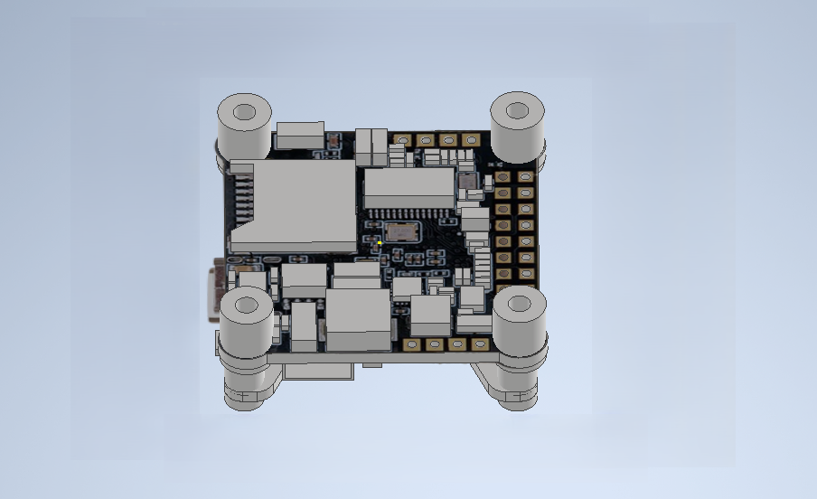

# Сборка

### Перечень крепежа

|Название|Количство (шт)|
|--------|---------|
|Винт M3x6| 28 |
|Винт M3x8 (НЕX)| 46 |
|Винт M3x12| 6 |
|Винт M3x14 (НЕX)| 8 |
|Гайка M3| 4 |
|Гайка нейлоновая M3| 2 |
|Стойка нейлоновая 5мм| 16 |
|Стойка металлическая 5мм| 16 |
|Стойка нейлоновая 15мм | 12 |
|Стойка нейлоновая 20мм | 4 |
|Стойка нейлоновая 40мм | 12 |
|Стойка металлическая 40мм | 4 |

### Сборка

1. Соединяем 4 луча с центарльной декой, закрепляя их только на центральных отверстиях четрырьмя винтами M3x14 (HEX) и металлическими гайками M3.

2. На нижней части центральной платформы установите металлические стойки 10мм закрепляя винтами M3x8 (НЕX)

3. Устанавливаем моторы на соответствующие отверстия в луче при помощи винтов M3x6. 

*Убедитесь, что винты не касаются мотора.*

4. Сборка ножек

    4.1 Закрепите нейлоновые стойки 15мм на одну из половин ножки используя винт M3x6

    

    4.2 Установите получившуюся конструкцию на луч дрона, закрепляя винтами M3x6 со второй частью.

    

5. Сборка и установка полётного контроллера (FC) и регулятора оборотов (ESC)

    5.1 На центральную раму устанавливаем 4 нейлоновые стойки 6мм, закрепляя их винтами M3x8 (HEX)

    5.2 Установите ESC и припаяйте к нему моторы

    5.3 Установите FC и закрепите винтами M3x12

    5.4 

6. Установите металлические стойки 40мм на лучах, фиксируя винтами M3x14 (HEX).На них закрепите верхнюю платформу используя винты M3x8 (НЕX)

7. Установка Orange Pi 5

    7.1 На нижнюю платформу для Orange Pi установите нейлоновые стойки M3(10мм + 6мм) и закрепите винтами M3x8 (НЕX)

    7.2 Закрепите полученнйю платформу на стойки, установленные на втором этапе

    7.3 Закрепите Orange Pi

7. Платформу для Orange Pi 5 закрепляем при помощи металлических стоек 4мм к нижней части центральной деки. Саму плату устанавливаем на нейлоновые стойки по 6мм

8. На нейлоновые стойки по 20мм устанавливаем нижнюю платформу, крепим её на винты M3x8

9. Финальный этап - установка защиты. Присоединяем защиту к ножкам винтами M3x12. Между собой части защиты закрепляем нейлоновыми стойками 40мм и винтами M3x12 (НЕX)

