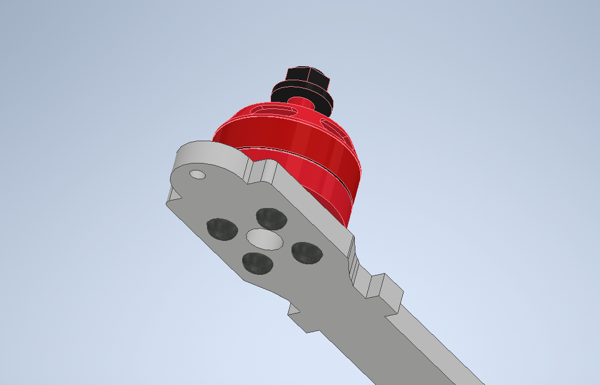

# Сборка

### Перечень крепежа

|Название|Количство (шт)|
|--------|---------|
|Винт M3x6| 24 |
|Винт M3x6 (НЕX)| 4 |
|Винт M3x8 (НЕX)| 44 |
|Винт M3x12| 8 |
|Винт M3x14 (НЕX)| 8 |
|Винт M3x25| 4 |
|Гайка M3| 12 |
|Гайка нейлоновая M3| 6 |
|Стойка металлическая 10мм| 4 |
|Стойка нейлоновая 10мм + 6мм| 4 |
|Стойка нейлоновая 15мм | 12 |
|Стойка нейлоновая 20мм | 4 |
|Стойка нейлоновая 40мм | 12 |
|Стойка металлическая 30мм | 4 |

### Сборка

1. Соединяем 4 луча с центарльной декой, закрепляя их только на центральных отверстиях четрырьмя винтами M3x14 (HEX) и металлическими гайками M3.

2. На нижней части центральной платформы установите металлические стойки 10мм закрепляя винтами M3x8 (НЕX)

3. Устанавливаем моторы на соответствующие отверстия в луче при помощи винтов M3x6 (HEX), которые идут в комплекте с моторами.

*Убедитесь, что винты не касаются мотора.*

4. Сборка ножек

    4.1 Закрепите нейлоновые стойки 15мм на одну из половин ножки используя винт M3x6

    

    4.2 Установите получившуюся конструкцию на луч дрона, закрепляя винтами M3x6 со второй частью.

    

5. Сборка и установка полётного контроллера (FC) и регулятора оборотов (ESC)

    5.1 На центральную раму устанавливаем 4 винта M3x25, закрепляя гайками M3 (посмотрите размеры монтажных отверстий на регуляторе оборотов. Не затягивайте гайки плотно, чтобы была возможность регулировки винтов)

    

    5.2 На гайки устанавливаем ESC, предварительно надев на него демпферные резинки. Припаиваем к нему моторы

    

    5.3 Припаиваем моторы как показано на схеме. Закрепляем провода моторов изолентой вокруг луча.

    

    5.3 Устанавливаем полётный контроллер, предварительно надев на него демпферные резинки. Закрепляем нейлоновыми гайками M3

    

6. Припаять провода к приёмнику и полётному контроллеру по указанной схеме. Длина проводов - 9см. Зтем прикрепить к приёмнику антенну и усадить его в термоусадку. 

7. После подключения проводов, приёмник в термоусадке приклеить на двусторонний скотч как показано на схеме. Антену закрепить с помощию двух стяжек крест накрест под лучом.

8. Установка Orange Pi 5

    8.1 На нижнюю платформу для Orange Pi установите нейлоновые стойки M3(10мм + 6мм) и закрепите винтами M3x8 (НЕX)

    

    8.2 Закрепите полученнйю платформу на стойки, установленные на втором этапе винтами M3x6 (НЕX)

    

    8.3 Закрепите Orange Pi нейлоновыми стойками по 20мм

    
    
    8.4 Устанавливаем нижнюю платформу, крепим к нейлоновым стойкам на винты M3x8 (HEX)
    
    

9. Сборка защиты

    9.1 Установите плату защиты на ножки дрона как показано на рисунке, используя винты M3x12 и гайку M3

    

    9.2 Установите стойки, закрепляя винтами M3x8 (НЕX)

    

    9.3 Закрепите оставшиеся защитные пластины при помощи стоек 40мм и винтов M3x8 (НЕX)

    

10. Установите светодиодную ленту как показано на рисунке

