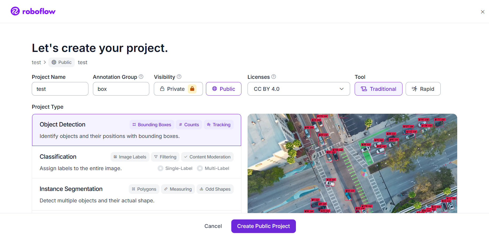
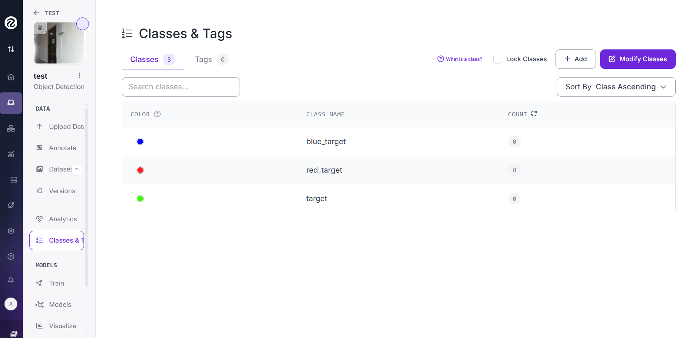
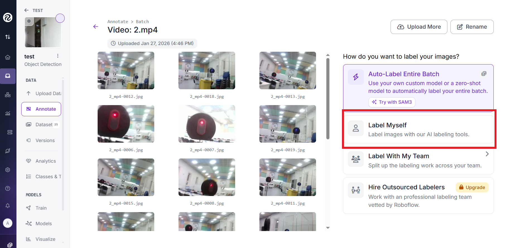
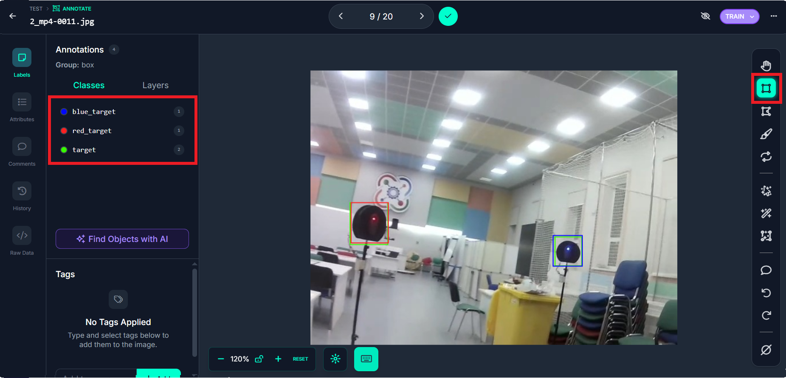
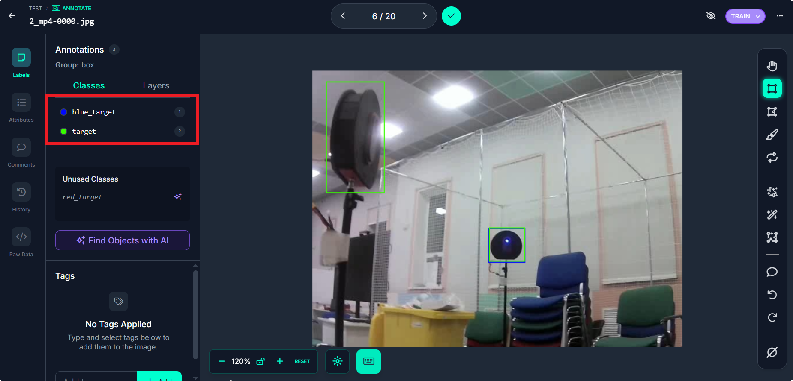

# Создание Dataset на Roboflow

[Roboflow](https://roboflow.com/) — это платформа для подготовки данных компьютерного зрения, которая позволяет собирать, размечать, предобрабатывать и экспортировать датасеты для обучения нейронных сетей. Для платформы Eurus-Edu мы будем создавать датасет для обнаружения различных объектов

### Регистрация и создание организации

После регистрации на Roboflow необходимо создать организацию (Workspace)

Организация в Roboflow позволяет:

- Совместно работать над датасетами с командой
- Централизованно управлять проектами и моделями
- Контролировать доступ и роли участников
- Использовать общие ресурсы и квоты
- Вести общую историю изменений и версий

Рекомендуемый способ создания организации - через веб-интерфейс ресурса:

1.  Войдите в ваш аккаунт Roboflow
2.  В левом верхнем углу нажмите на текущее название workspace (по умолчанию ваше имя)
3.  Выберите "Create New Workspace"
4.  Заполните форму:

    `Workspace Name`: Eurus-Edu

    `Workspace URL`: eurus-edu (будет: roboflow.com/eurus-edu)

    `Plan`: Выберите Free

5.  Нажмите "Create Workspace"

Организация создана, теперь нужно добавить в неё участников:

1.  В боковом меню выберите "Members"
2.  Нажмите "Invite Members"
3.  Введите email участников
4.  Нажмите "Send Invites"

В Roboflow участникам можно задавать роли:

| Роль      | Права                                                           |
| --------- | --------------------------------------------------------------- |
| Admin     | Полный доступ ко всем проектам и настройкам                     |
| Developer | Создание/редактирование проектов, обучение моделей, экспорт     |
| Annotator | Загрузка изображений, разметка данных, создание версий          |
| Viewer    | Просмотр проектов, датасетов, моделей. Без права редактирования |

### Cоздание проекта

После создания организации создаём новый проект во вкладке Projects. Заполняем параметры:

- `Project Name`: eurus-edu (или ваше название)
- `Project Type`: Выберите Object Detection (обнаружение объекта)
- `Annotation Group`: название объектов, которые будем размечать
- `tool`: traditional

### Создание классов для разметки

В левой панели выбираем "Classes"

Класс в платформе Roboflow - это тип объектов, который система компьютерного зрения может распознавать и понимать.

В имени класса лучше задавать название определяемого объекта, цвет можно выбрать любой

Для проекта задаём три класса:

- `target` - для обозначения всех мишеней
- `red_target` - красная мишень
- `blue_target` - синяя мишень

### Загрузка видео для разметки

Видео для извлечения кадров с объектом записываем при помощи кода на Python.
Определяемый объект рекомендуется снимать с разных ракурсов и при разном освещении

Код для записи видео:

Загружаем видео в блок Unassigned во вкладке Annotation

Рекомендуемая частота кадров - по 1 кадру каждые 0.2 секунды

### Сбор кадров

На этом этапе удаляем неудачные кадры (сильно размытые или те, на которых объект не попал в кадр) и только после этого начинаем разметку dataset вручную (Label Myself)

### Разметка dataset

На каждом кадре выделяем объект рамкой заранее подготовленного класса

`target` - обязательный класс для обозначения всех мишеней

`red_target` - только красные мишени

`blue_target` - только синие мишени

_После разметки кадра обозначены 2 объекта target и по одному объекту blue_target и red_target_

_На этом кадре не видно какого цвета вторая мишень, поэтому обозначаем её одним классом target_

После разметки всех кадров нажимаем на галочку и добавляем кадры в общий датасет. Метод сохранения выбираем `Split images Between Train/Valid/Test`

