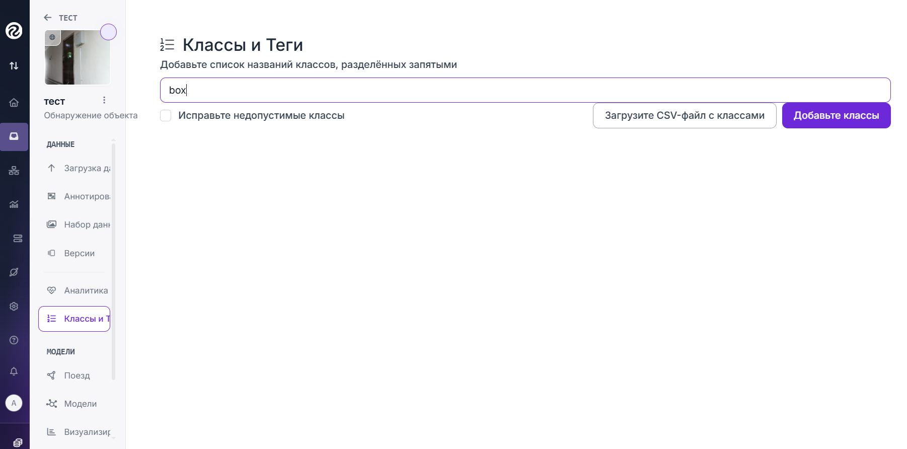
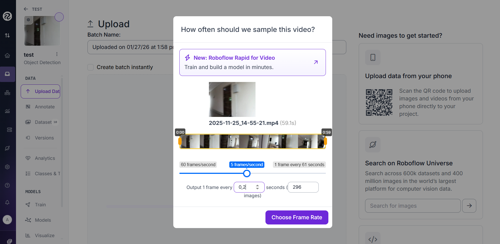
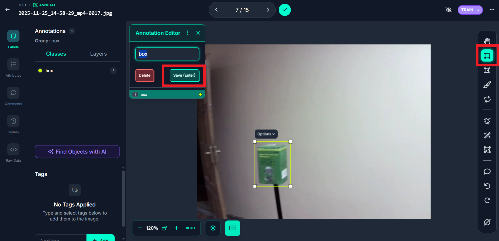
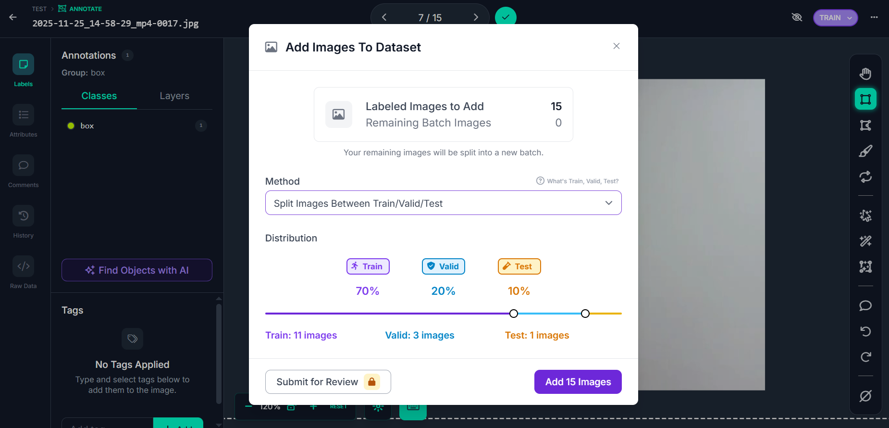

# Создание Dataset на Roboflow

[Roboflow](https://roboflow.com/) — это платформа для подготовки данных компьютерного зрения, которая позволяет собирать, размечать, предобрабатывать и экспортировать датасеты для обучения нейронных сетей. Для платформы Eurus-Edu мы будем создавать датасет для обнаружения различных объектов


### Регистрация и создание проекта

После регистрации создаём новый проект во вкладке Projects. Заполняем параметры:

-   ```Project Name```: eurus-edu (или ваше название)
-   ```Project Type```: Выберите Object Detection (обнаружение объекта)
-   ```Annotation Group```: название объектов, которые будем размечать
-   ```tool```: traditional


### Создание классов для разметки

В левой панели выбираем "Classes"

Класс в платформе Roboflow - это тип объектов, который система компьютерного зрения может распознавать и понимать.

В имени класса лучше задавать название определяемого объекта, цвет можно выбрать любой




### Загрузка видео для разметки

Видео для извлечения кадров с объектом записываем при помощи кода на Python. 
Определяемый объект рекомендуется снимать с разных ракурсов и при разном освещении 

Код для записи видео: 

Загружаем видео в блок Unassigned во вкладке Annotation

Рекомендуемая частота кадров - по 1 кадру каждые 0.2 секунды




### Сбор кадров

На этом этапе удаляем неудачные кадры (сильно размытые или те, на которых объект не попал в кадр) и только после этого начинаем разметку dataset вручную (Label Myself) 


### Разметка dataset

На каждом кадре выделяем объект рамкой заранее подготовленного класса




После разметки всех кадров нажимаем на галочку и добавляем кадры в общий датасет. Метод сохранения выбираем ```Split images Between Train/Valid/Test```

