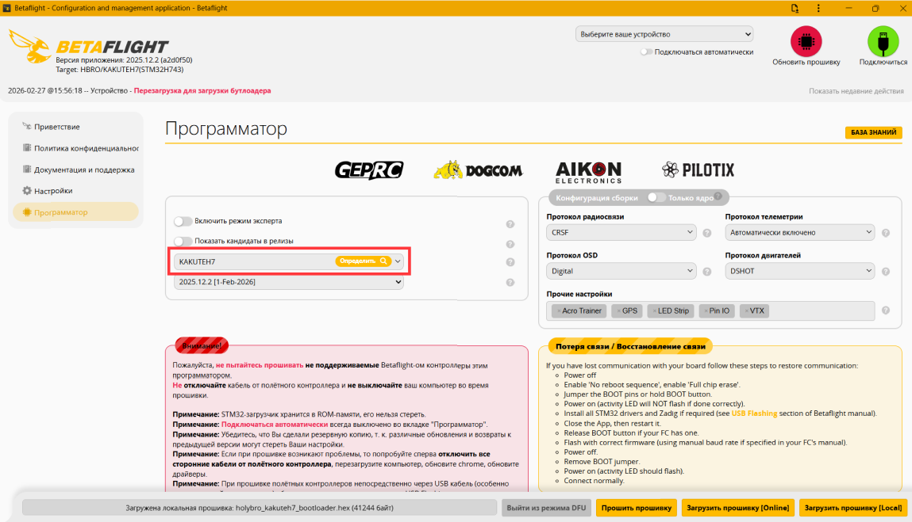
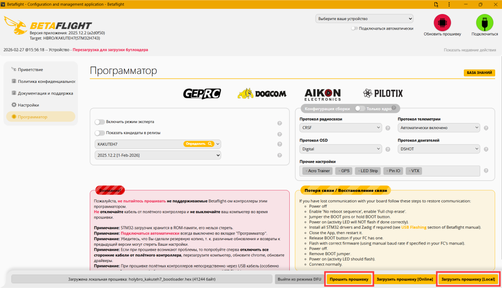

# Прошивка Bootloader

На плате предустановлена ​​программа Betaflight. Для прошивки загрузчика PX4 можно использовать три инструмента: Betaflight Configurator, утилиту командной строки [dfu-util](https://dfu-util.sourceforge.net/) или графический инструмент [Dfuse](https://www.st.com/en/development-tools/stsw-stm32080.html) (только для Windows)

Рекомендуемый способ прошивки - Betaflight

### Для установки загрузчика PX4 с помощью Betaflight Configurator :

1\. Загрузите бинарный файл загрузчика [kakuteh7_bl.hex](https://raw.githubusercontent.com/PX4/PX4-Autopilot/main/docs/assets/flight_controller/kakuteh7/holybro_kakuteh7_bootloader.hex), при сохранении выбрав "все файлы"

2\. Загрузите [конфигуратор Betaflight](https://www.betaflight.com/docs/wiki/guides/current/Installing-Betaflight)

3\. Дополнительно установите драйвер [Zadig](https://zadig.akeo.ie/), обязательно перезагрузив компьютер после установки

4\. Подключите полётный контроллер к ноутбуку по USB

5\. В конфигураторе Betaflight, во вкладке "Программатор" найдите подключенный полётник, нажав кнопку "Определить" в строке "Выберите полётный контроллер"

6\. Нажмите на кнопку "Згрузить прошивку (Local)" на нижней панели, выберите скачанный ранее файл bootloader.

Для запуска процесса нажмите кнопку "Прошить прошивку"

