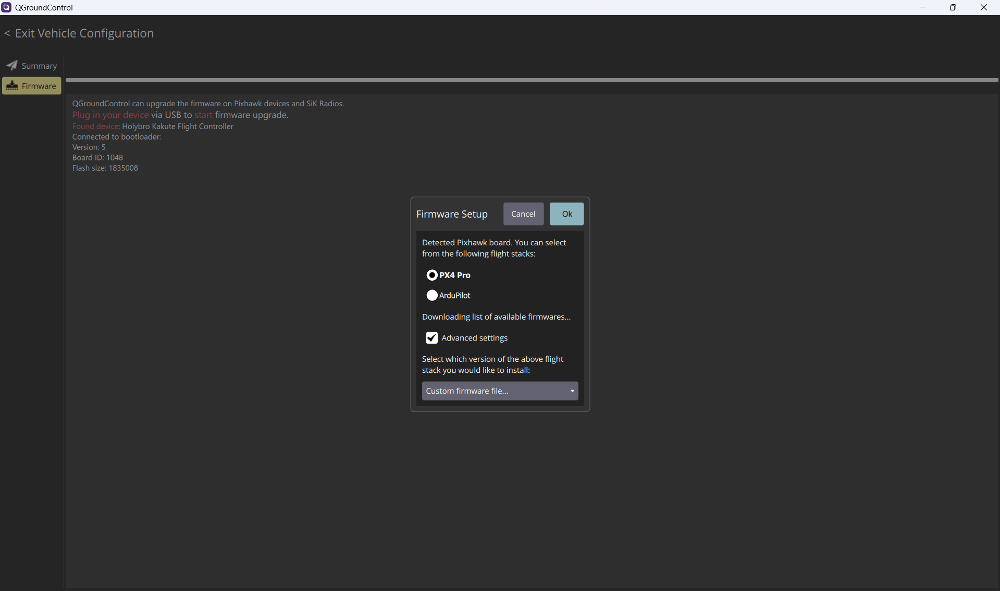
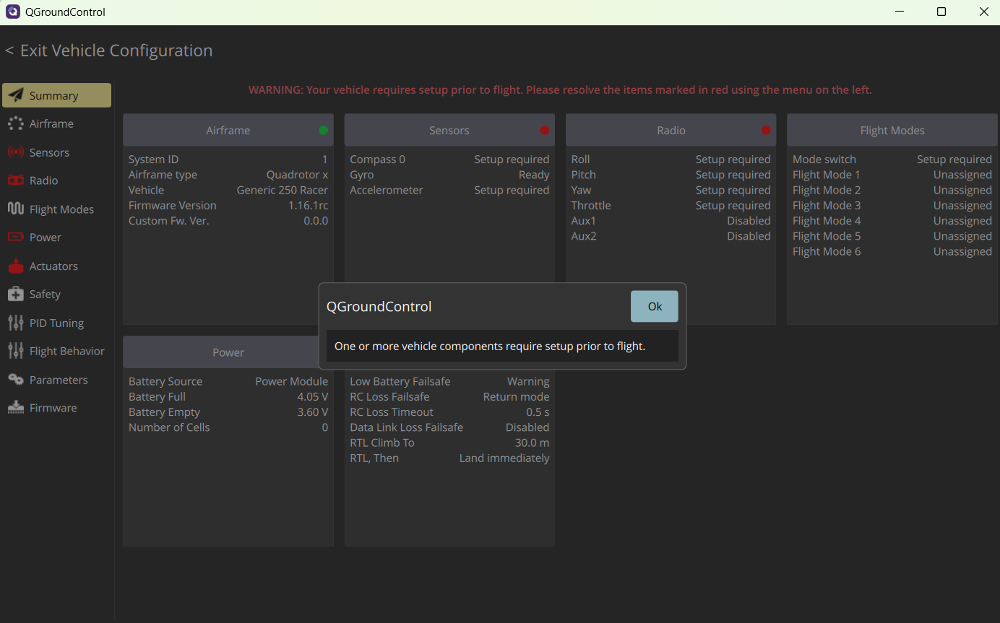
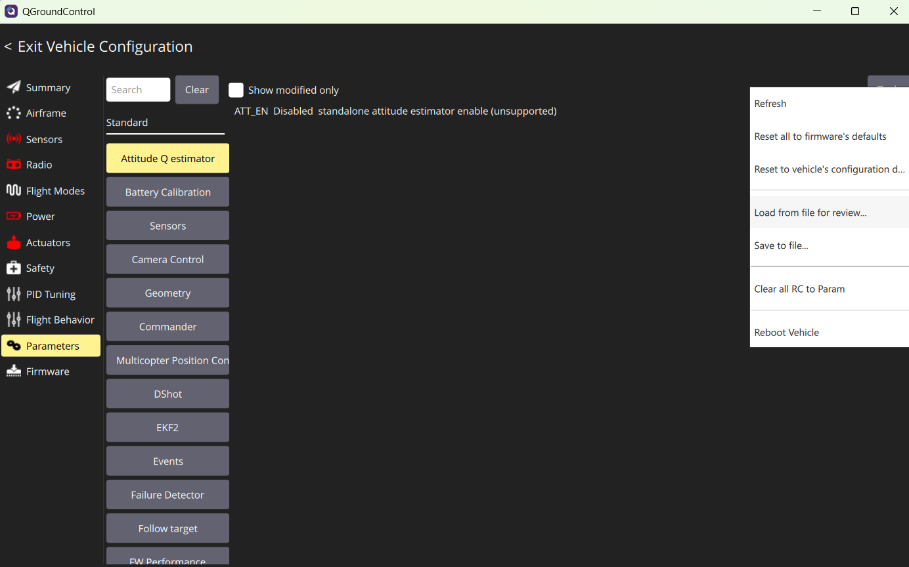
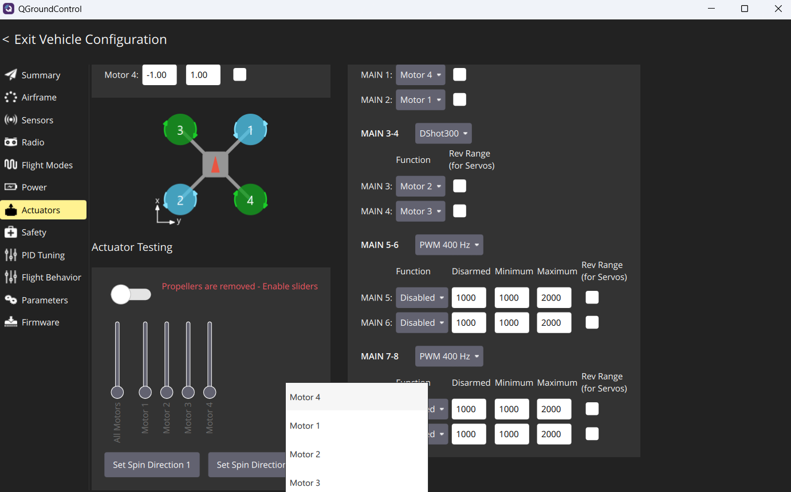
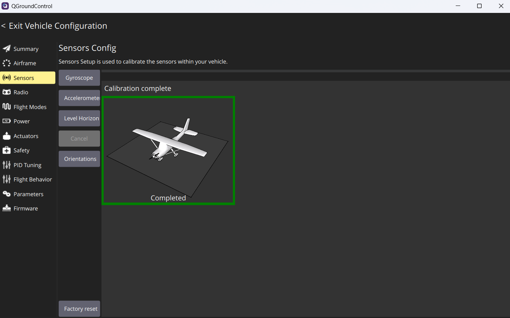
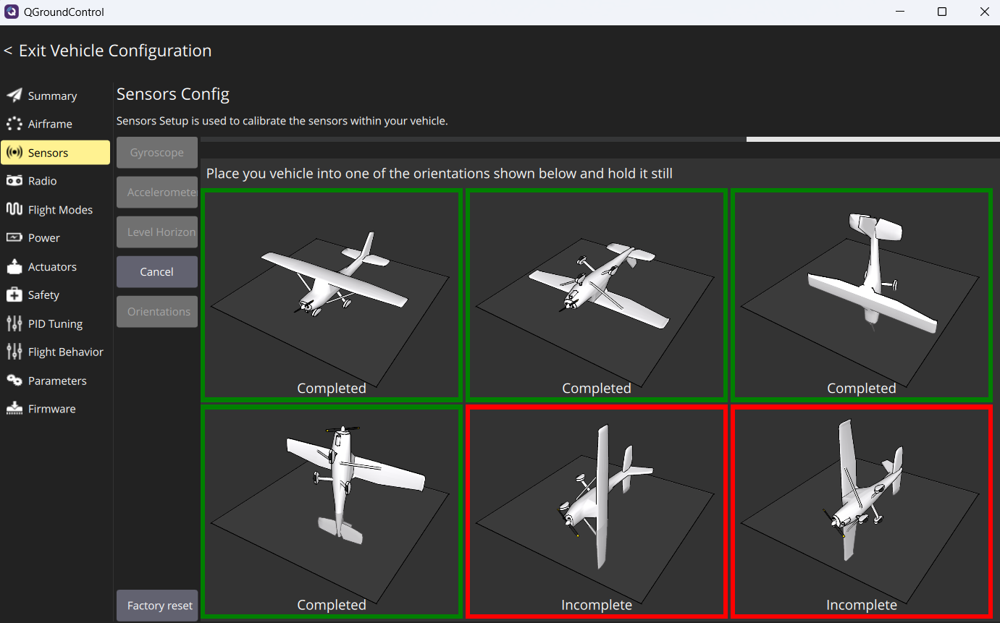
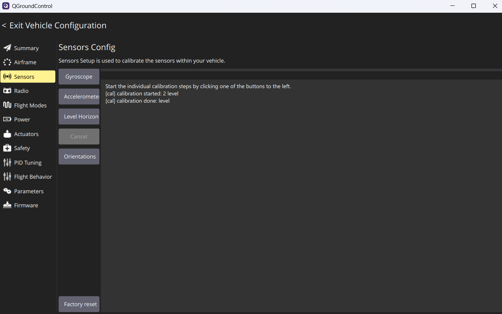

# Прошивка PX4

Для установки прошивки на плату полётного контроллера рекомендуется использовать [QGroundControl](https://docs.qgroundcontrol.com/Stable_V5.0/en/qgc-user-guide/getting_started/download_and_install.html) (важно установить Desktop-версию)

Вы можете скачать прошивку для полётного контроллера и параметры на [Яндекс.Диск](https://disk.yandex.ru/d/TYp1XGe0WAdJdQ) в папке PX4/holybro_kakuteh7

### Для установки PX4:

1\. Запустите QGroundControl

2\. Перейдите в раздел настройки:
Нажмите на иконку Q (вверху слева) → Vehicle Configuration → Firmware (Прошивка)

3\. Подключите полётный контроллер к ноутбуку по USB

4\. QGC должен его увидеть (если нет — проверьте драйверы, кабель, другой порт USB)

5\. В открывшемся окне выбираем вариант прошивки. Нажимаем Advanced settings и в выпадающем списке Custom firmware file.

6\. Нажмите OK, выберите файл прошивки ([eurus_edu_kakuteh7.px4](https://disk.yandex.ru/d/jjcHS1yikT_eKg)), после этого начнётся загрузка прошивку в полётный контроллер.

- Процесс занимает 1–3 минуты.

- Внизу будет консоль — следите, чтобы не было подобных ошибок: «FMUv2 target on modern board» (если увидите — возможно, нужно обновление bootloader)

7\. После успешной прошивки полётный контроллер перезагрузится.

8\. Загружаем параметры локально ([eurus_edu_kakuteh7.params](https://disk.yandex.ru/d/itE5RJvaDDxU5Q)), перейдя во вкладку Parameters → Tools → load from file for review

9\. Перейдём к настройке моторов. Питаем дрон от аккумулятора. Проверьте, что на моторах не установлены пропеллеры.

Во вкладке Actuators важно проверить направления вращения моторов, запуская их вручную, двигая стики в режиме включённых моторов. При необходимости поменяйте направление (Set Spin Direction)

10\. Настроим датчики в разделе Sensors. Доступные датчики отображаются в виде списка кнопок рядом с боковой панелью, нажимайте по очереди на каждый датчик, чтобы запустить последовательность калибровки.

- Gyroscope

    Поставьте дрон на ровную поверхность и оставьте его неподвижным. Нажмите OK. По завершении QGroundControl отобразит индикатор выполнения: «Калибровка завершена».

    

- Accelerometer → OK

    Поставьте дрон на ровную поверхность, оставьте его неподвижным и нажмите OK. Для калибровки акселерометров полётного контроллера вам потребуется установить и удерживать дрон в нескольких положениях (настроенные положения будут подсвечиваться зелёным). Дрон важно держать ровно

    

- Level Horizon

    Настройка определяет положение горизонта. Установите летательный аппарат в горизонтальное положение на ровной поверхности и нажмите OK

    
