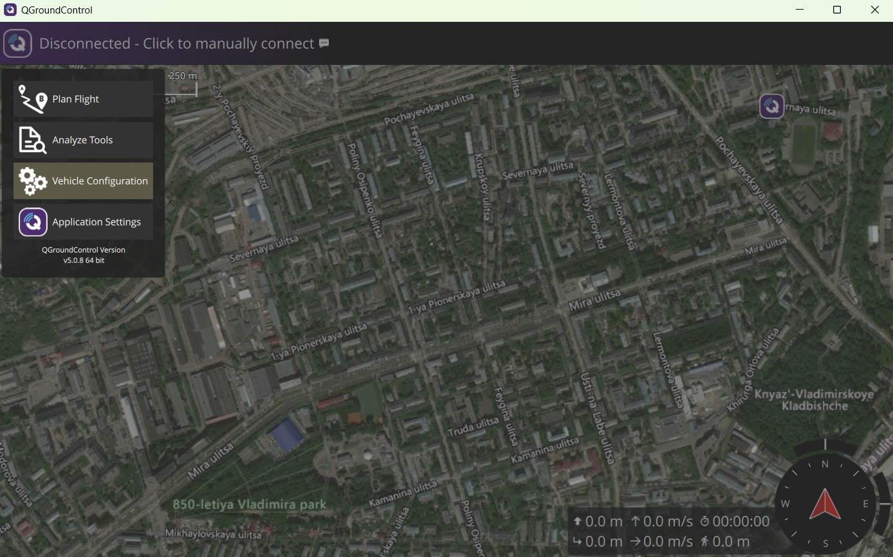

# Прошивка PX4

Для установки прошивки на плату полётного контроллера рекомендуется использовать [QGroundControl](https://docs.qgroundcontrol.com/Stable_V5.0/en/qgc-user-guide/getting_started/download_and_install.html) (важно установить desktop-версию)

На плате предустановлена ​​программа Betaflight. Перед установкой прошивки PX4 необходимо прошить загрузчик PX4. Загрузите бинарный файл загрузчика [kakuteh7_bl.hex](https://raw.githubusercontent.com/PX4/PX4-Autopilot/main/docs/assets/flight_controller/kakuteh7/holybro_kakuteh7_bootloader.hex)

Для прошивки загрузчика PX4 можно использовать три инструмента: Betaflight Configurator, утилиту командной строки [dfu-util](https://dfu-util.sourceforge.net/) или графический инструмент [dfuse](https://www.st.com/en/development-tools/stsw-stm32080.html) (только для Windows)

**Важно:**

-   Подключайте полётный контроллер напрямую к компьютеру по USB

-   Не подавайте питание от LiPo-батареи во время прошивки (только USB)

## Для установки загрузчика PX4 с помощью Betaflight Configurator :

1\. 

## Для установки PX4:

1\. Запустите QGroundControl

2\. Подключите полётный контроллер по USB

3\. QGC должен его увидеть (если нет — проверьте драйверы, кабель, другой порт USB)

4\. Перейдите в раздел настройки:
Нажмите на иконку Q (вверху слева) → Vehicle Configuration → Firmware (Прошивка)

5\. В открывшемся окне выбираем вариант прошивки. рекомендуется версия PX4 Pro Stable Release vX.X.X — самая стабильная версия, QGC сам подберёт правильный target под вашу плату

6\. Нажмите OK / Load → QGC скачает и начнёт прошивку.
-   Процесс занимает 1–3 минуты.

-   Внизу будет консоль — следите, чтобы не было ошибок типа «FMUv2 target on modern board» (если увидите — возможно, нужен апдейт бутлоадера)

7\. После успешной прошивки:
-   Контроллер перезагрузится.

-   QGC предложит выбрать Airframe (тип рамы: Quad X, Hex, Plane и т.д.)

-   Далее идут калибровки (компас, акселерометр, радио, ESC и т.д.)