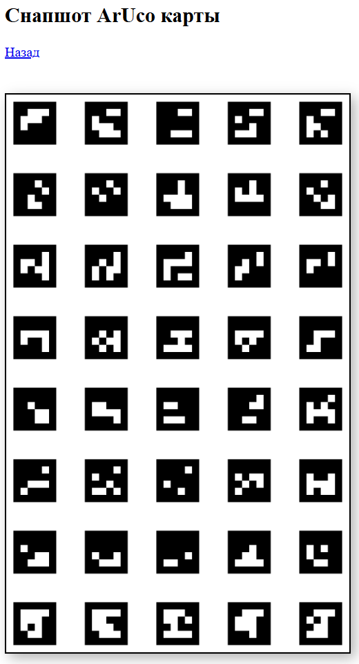

# Навигация по карте ArUco маркеров

## Конфигурирование

Аргументы настройки Aruco находятся в файле `~/ros2_ws/src/eurus_edu/edu_aruco_navigation/eurus.ini`:

```python
[aruco]
; 4x4_50/4x4_100/4x4_250/4x4_1000/5x5_50/5x5_100/5x5_250/5x5_1000/
dictionary = 4X4_1000
map_path = /home/orangepi/ros2_ws/src/eurus_edu/edu_aruco_navigation/maps/map.csv

[settings]
aruco_debug = true
camera_topic = /edu/downward_camera
camera_config_path = /home/orangepi/ros2_ws/src/eurus_edu/camera_calib/calibration_data.json
camera_direction = 0
```

**Где:**

- `dictionary` - словарь ArUco маркеров (доступны: 4x4_50, 4x4_100, 4x4_250, 4x4_1000, 5x5_50, 5x5_100, 5x5_250, 5x5_1000)

- `map_path` - путь к файлу карты маркеров

- `aruco_debug` - включение отладки (true/false)

- `camera_topic` - топик камеры для распознавания маркеров

- `camera_config_path` - путь к файлу калибровки камеры

- `camera_direction` - поворот камеры в градусах

## Настройка карты маркеров

Карта маркеров хранится в CSV файле по пути
`/home/orangepi/ros2_ws/src/eurus_edu/edu_aruco_navigation/maps/map.csv`

**Формат файла (разделитель ;):**

```python
id;length;x;y;z
250;0.3000;0.0000;3.5000;0.1000
```

**Где:**

- `id` - идентификатор ArUco маркера

- `length` - длина стороны маркера в метрах

- `x, y, z` - координаты маркера в метрах

## Генерация карты маркеров

Для генерации файла карты маркеров используется скрипт generate_map.py, расположенный в директории `/home/orangepi/ros2_ws/src/eurus_edu/edu_aruco_navigation/edu_aruco_navigation/generate_map.py`

Также скрипт можно запустить на ПК:

```python
python generate_map.py cx cy length sx sy
```

**Параметры:**

- `cx` - количество маркеров по оси X

- `cy` - количество маркеров по оси Y

- `length` - длина стороны маркера в метрах

- `sx` - расстояние между центрами маркеров по оси X в метрах

- `sy` - расстояние между центрами маркеров по оси Y в метрах

**Дополнительные параметры:**

- `-o, --out` - задать имя выходного файла (по умолчанию generated_map.csv)

- `-i, --id` - начальный ID маркера (по умолчанию 0)

- `-bl, --bottom_left` - нумерация маркеров с левого нижнего угла

- `-rev, --reverse` - записать маркеры в обратном порядке ID

**Пример:**

```python
python generate_map.py 8 5 0.3 0.5 0.5 -i 100 -bl
```

Данная команда создаст файл `generated_map.csv` с маркерным полем 8×5, где длина стороны маркера 0.3 м, расстояние между центрами по X и Y - 0.5 м, начальный маркер - ID 100 (карта от 100 до 139 маркера), с началом координат (0, 0) в левом нижнем маркере.

## Проверка

Для контроля карты, по которой в данный момент дрон осуществляет навигацию, в веб-интерфейсе можно посмотреть snapshot ArUco карты


