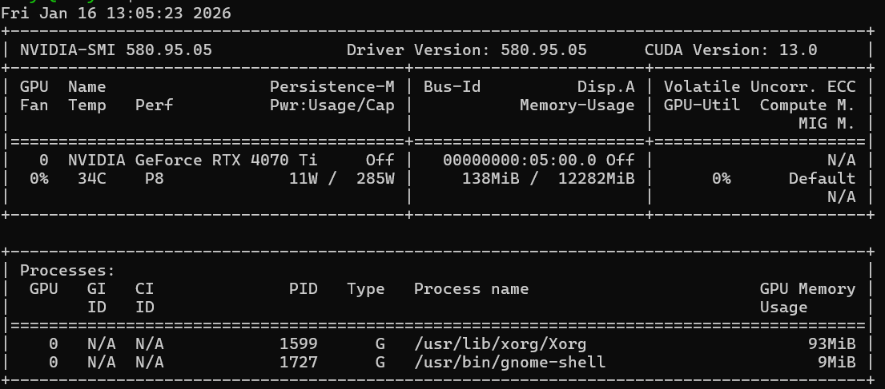
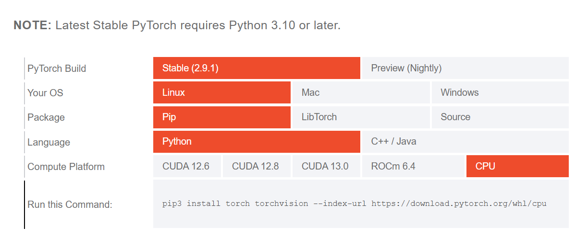
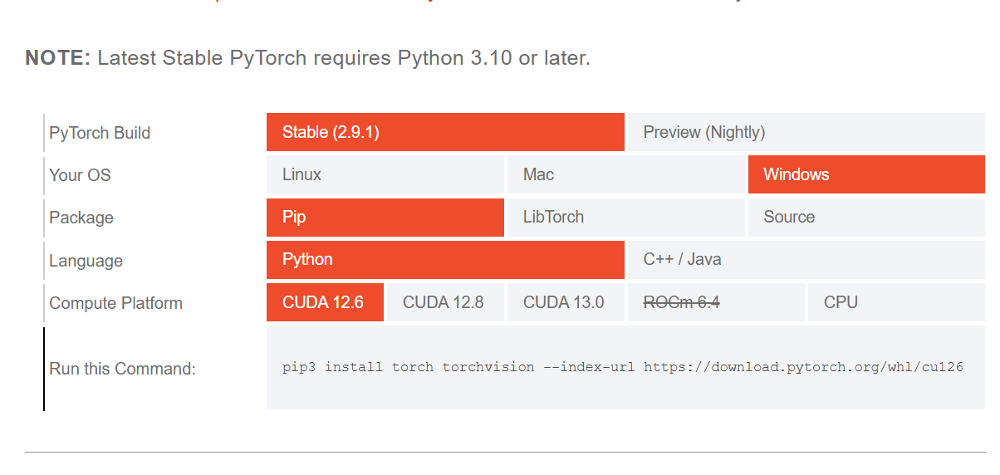
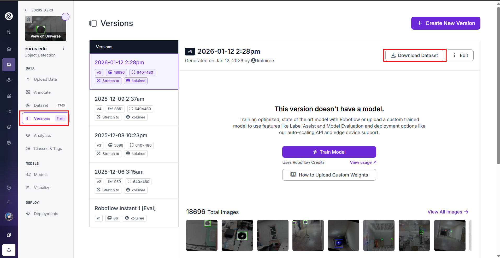
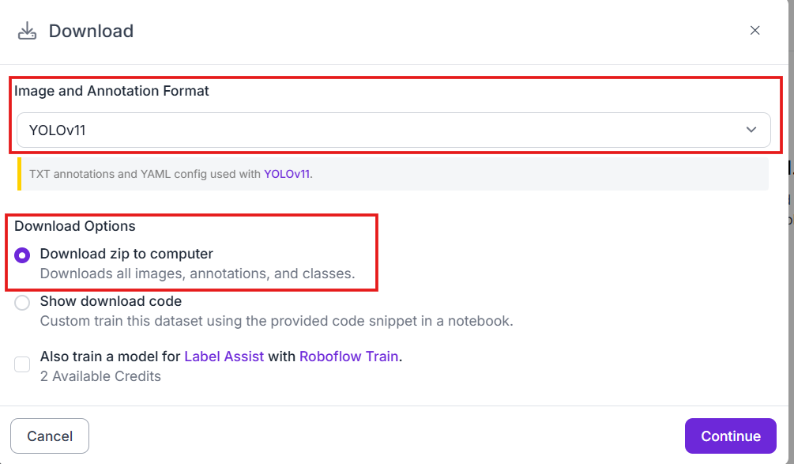
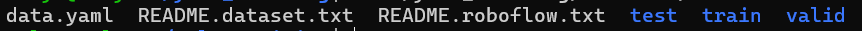

# Обучение модели YOLOv11

Имеется два способа обучить нейронную сеть:

-   На локальной машине
-   С помощью Google Colab

Рассмотрим оба способа обучения своей нейронной сети

### Обучение нейронной сети на локальной машине

#### Установка инструментов для обучения

#### Linux/Windows

Требования:

-   \>=Python3.10

**Установка PyTorch и Ultralytics**

Подробную информацию по установке можно найти в официальной [документации Ultralytics.](https://docs.ultralytics.com/quickstart/#use-ultralytics-with-cli)

**Установка PyTorch:**

Устанавливаем версию PyTorch в зависимости от системных характеристик. Версию CUDA можно проверить командой:

```bash
nvidia-smi
```



В случае, если у вас видеокарта AMD, можно проверить ROCm с помощью команды (только для Linux):

```bash
rocminfo
```

Заходим на [официальный сайт PyTorch](https://pytorch.org/get-started/locally/) и выбираем подходящую версию.
_В случае, если у вас нет видеокарты, выбираем CPU._




Выполняем команду для установки PyTorch.

**Установка Ultralytics**

С помощью pip устанавливаем библиотеку:

```bash
pip install -U ultralytics
```

#### Запуск обучения

#### Linux/Windows

Сперва скачиваем датасет с нашего проекта на Roboflow, заходим в наш проект → versions → Выбираем последнюю версию датасета → Download Dataset


После этого в Image and Annotation Format выбираем нашу модель (YOLOv11), ставим пункт Download zip to computer и нажимаем Continue.


Рекомендуется создать отдельную папку под обучение нейросети.
Распаковываем туда архив с датасетом

**Пример для Linux:**

```bash
mkdir -p ~/yolo_train/dataset
unzip dataset.zip ~/yolo_train/dataset
cd ~/yolo_train
```

В папке ~/yolo_train/dataset мы увидим содержимое датасета:



Из этого нам требуется data.yaml, его надо указать при обучении нейросети

Запуск обучения:

```bash
cd ~/yolo_train
yolo detect train model=yolo11n.pt data=./dataset/data.yaml batch=-1 epochs=150 patience=20
```

После завершения обучения в директории ~/yolo_train/runs/detect/ должна появиться папка train/train2/train3 и т.д., в зависимости от того, какой раз вы запускаете обучение.

В папке ~/yolo_train/runs/detect/train/weights лежит файл best.pt, это и является файлом с весами для нашей модели нейронной сети.

Объяснение некоторых параметров команды yolo detect train:

-   `model` - Это желаемая модель для обучения, для образовательного дрона Eurus Edu рекомендуется yolo11n.pt
-   `data` - Указывается путь к data.yaml датасета, который будет использоваться при обучении нейронной сети
-   `batch` - Количество данных для обучения в одной итерации (значение -1 значит что утилита автоматически выберет batch, для большей эффективности рекомендуется подобрать самому)
-   `epochs` - Количество полных проходов нейросети через весь набор данных
-   `patience` - Механизм ранней остановки обучения, в случае если нейросеть перестанет улучшать свои результаты с каждым эпохом (epochs), обучение нейросети остановится автоматически

**Возможные ошибки**
`CUDA out of memory` - слишком большое количество batch, не хватает видеопамяти
