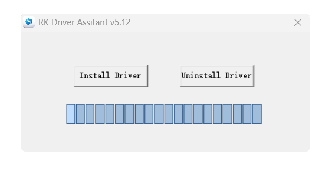
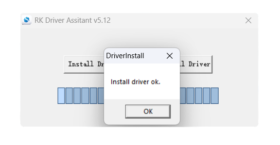
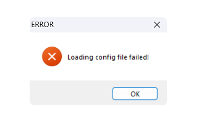
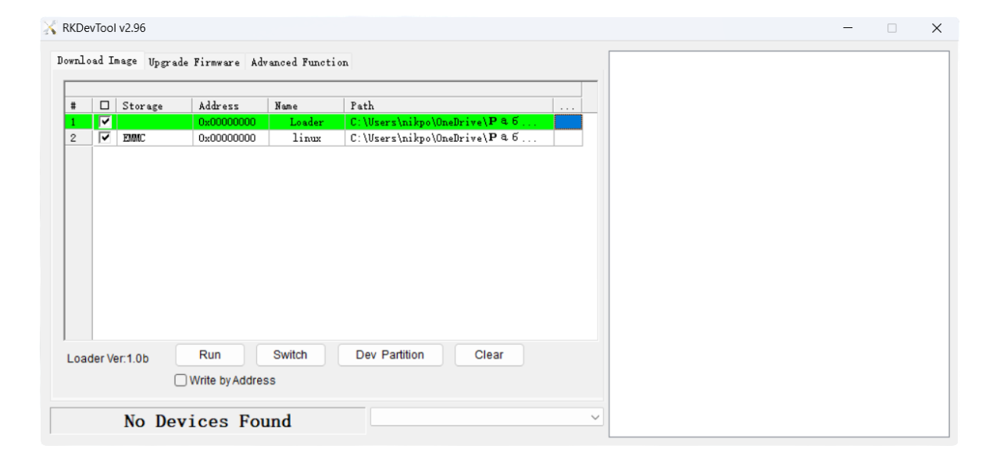
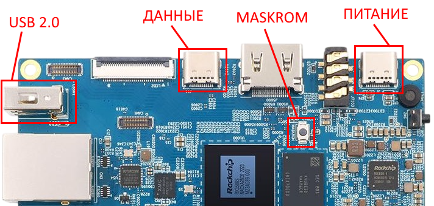
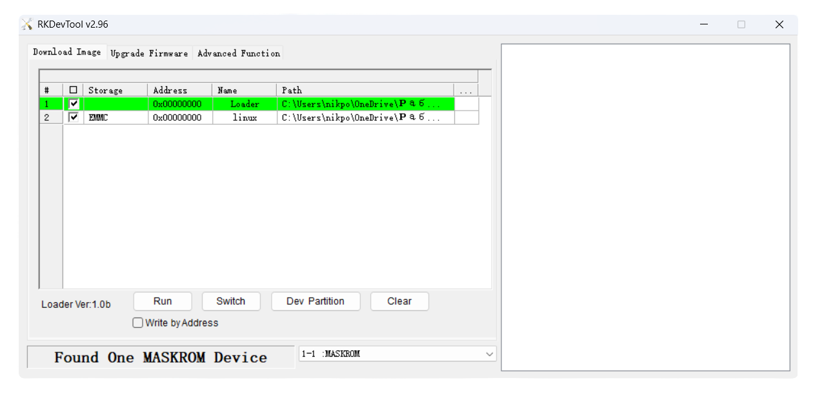
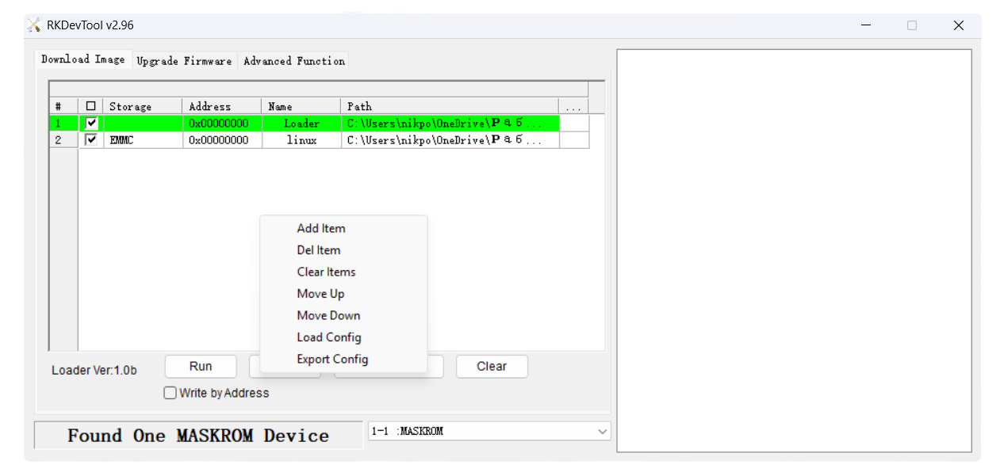
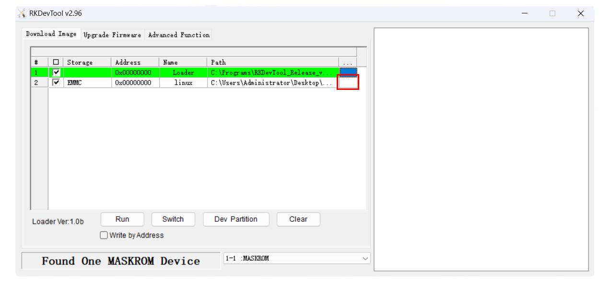
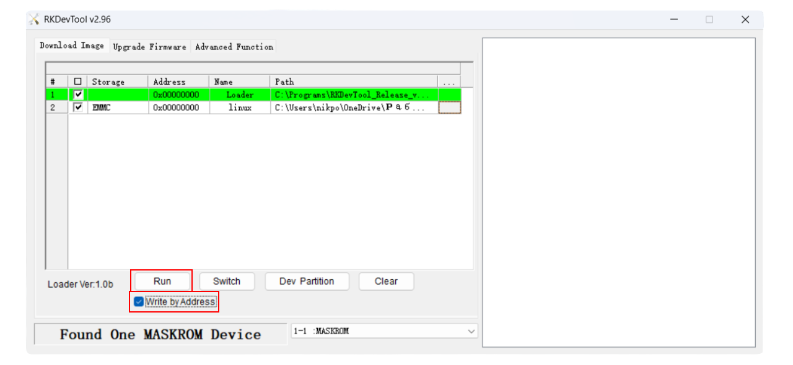
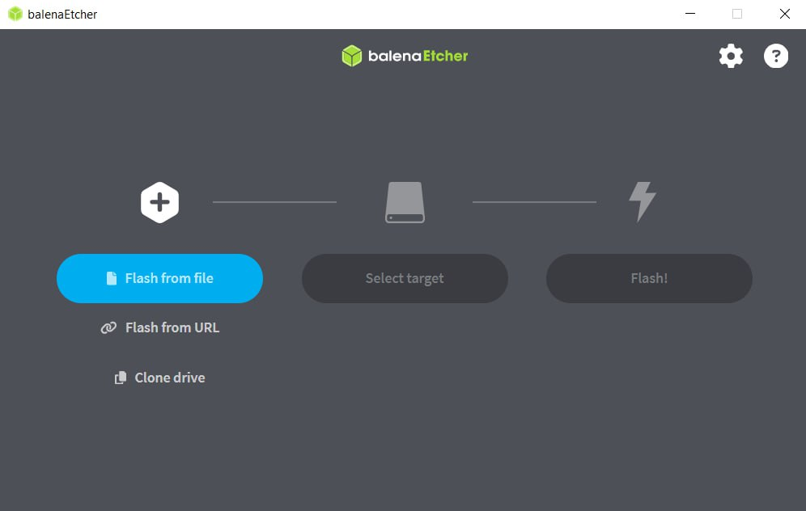

# Образ для Orange Pi 5B

Eurus-Edu представляет собой готовый образ системы на базе [Linux](https://www.linux.org/) со встроенной средой ROS.
Он содержит всё необходимое программное обеспечение для комфортной работы с образовательной платформой.
Исходные коды для сборки этого образа и всех дополнительных компонентов [открыты и размещены на GitHub](https://github.com/EurusAero/eurus_edu).

### Загрузка программного обеспечения

Актуальные стабильные образы для Orange Pi 5B, прошивка и параметры для полётного контроллера, а также необходимые программы для загрузки образов доступны на Яндекс.Диске по ссылке ниже.

- [Яндекс.Диск с актуальным ПО](https://disk.yandex.ru/d/TYp1XGe0WAdJdQ)

### Инструкция для записи образа на eMMC

1. С Яндекс.Диска из папки `Tools` скачайте папку `emmc-image-burning` — в ней находится всё необходимое программное обеспечение.
2. Распакуйте архив `DriverAssistant_v5.12.zip` и запустите файл `DriverInstall.exe`. У вас должно появиться следующее окно:

3. Нажмите на кнопку "Install Driver" и дождитесь установки драйвера. После успешной установки появится данное окно:

4. Далее распакуйте архив `RKDevTool_Release_v2.96.zip` и папку `MiniLoader`. Убедитесь, что в пути к утилите нет кириллицы (русских букв) — это может вызвать ошибку, как на фото ниже:

5. Запустите RKDevTool. Откроется окно программы с надписью "No Devices Found".

6. Подключите Orange Pi к компьютеру:
    - Через разъем Type-C, помеченный на фото как "Данные", подключите плату к компьютеру (с помощью данного разъема невозможно подать питание на Orange Pi).
    - Убедитесь, что к портам USB 2.0 ничего не подключено.
    - С зажатой кнопкой Maskrom подайте питание на Orange Pi.

7. В программе RKDevTool должна появиться надпись: "Found One MASKROM Device".

8. Нажмите правой кнопкой мыши по центральному полю окна и выберите "Load config". Найдите файл `rk3588_linux_emmc.cfg`, который находится в ранее разархивированной папке MiniLoader.

9. Нажмите на пустую ячейку (обведена на скриншоте) и в открывшемся проводнике выберите файл `MiniLoaderAll.bin` из папки MiniLoader.

10. Нажмите на ячейку ниже (обведена на скриншоте) и в проводнике выберите ранее скачанный файл образа (`.img`).

11. Обязательно установите галочку напротив пункта "Write by Address" и после этого нажмите кнопку "Run". Дождитесь завершения установки (в окне справа должна появиться надпись "Download image OK").

### Пошаговая инструкция для записи образа на SD-карту

1. Установите [BalenaEtcher](https://etcher.balena.io/), следуя инструкциям на официальном сайте.
2. Подготовьте MicroSD-карту объёмом не менее 32 ГБ. Вставьте её в кард-ридер вашего компьютера.
3. В программе BalenaEtcher выполните следующие действия:
    - Нажмите "Flash from file" и выберите скачанный файл образа (архив `.img.zip` распаковывать не нужно).
    - Нажмите "Select target" и выберите вашу MicroSD-карту. Убедитесь, что выбрали правильный диск, так как перед записью все данные на нём будут безвозвратно удалены.
    - Нажмите "Flash" для начала процесса записи.

    

4. Дождитесь завершения. Программа проверит записанные данные, после чего сообщит об успешном завершении процесса.

### Запуск платформы

1. Если вы используете SD-карту, установите её в соответствующий слот на плате Orange Pi 5B. _(Если вы записывали образ во внутреннюю память eMMC, убедитесь, что слот для SD-карты пуст)._
2. Подключите питание к Orange Pi 5B.
3. Дождитесь первой загрузки (это может занять 2-5 минут). Готовность платформы к работе будет обозначаться появлением активной точки доступа Wi-Fi.
