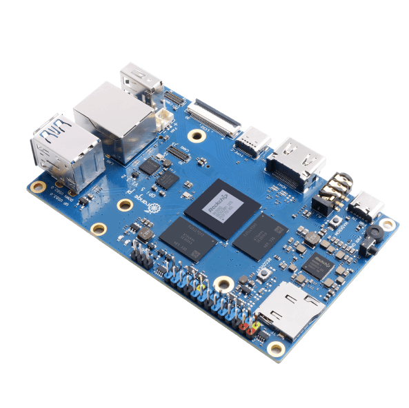
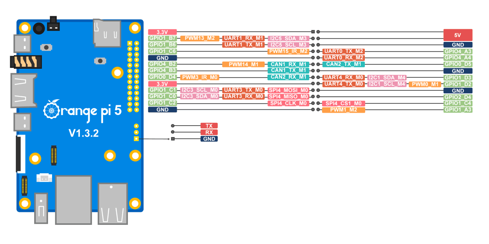

# Работа с Orange Pi 5

**Orange Pi 5** — одноплатный компьютер на базе восьмиядерного процессора Rockchip RK3588S. 
Устройство используется в проектах промышленной автоматизации, системах видеонаблюдения с аналитикой, разработке IoT-решений и создании компактных медиацентров.

Технические характеристики:

-  Вес - 46 грамм
-  Размеры - 100х62 мм.
-  Разъёмы HDMI 2.1 и Type-C с поддержкой DisplayPort
-  Четыре порта USB 3.0 и два порта USB 2.0 обеспечивают подключение периферийных устройств
-  GPIO-разъём с 40 контактами позволяет интегрировать дополнительные сенсоры и исполнительные устройства
-  Графический процессор поддерживает OpenGL ES 3.2, OpenCL 2.2 и Vulkan 1.1
-  Поддержка декодирования видео в форматах H.265/H.264 с разрешением до 8K при 60 кадрах в секунду и аппаратного кодирования H.264/H.265 до 4K при 60 fps
-  Встроенная флеш-память - eMMC 5.1 объёмом 64 ГБ. Дополняется слотом для карт microSD, позволяя расширить дисковое пространство до 2 ТБ

В Eurus-Edu Orange Pi 5 подключается к полётному контроллеру и используется как воспомогательный компьютер. Он позволяет подключаться к дрону по Wi-Fi, программировать автономные полёты, работать с периферией и многое другое.
