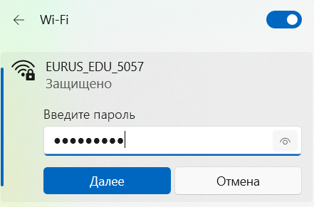

# Подключение по Wi-Fi

Для доступа по SSH необходимо подключиться к Orange Pi по Wi-Fi После загрузки платформа создаст собственную Wi-Fi сеть для управления.

- Имя сети (SSID): ` EURUS_EDU_xxxx` (вместо "х" случайные цифры)
- Пароль: `euruswifi`

Подключитесь к этой сети с любого устройства. Это откроет доступ ко всем функциям:

- Управление через QGroundControl
- Подключение по SSH для расширенной настройки
- Передача телеметрии

Для подтверждения успешной установки и проверки версии образа подключитесь по SSH (ip дрона: `10.42.0.1`)
