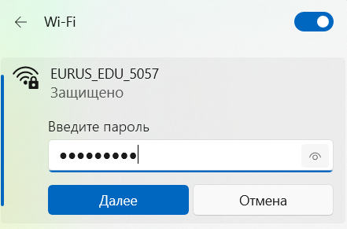

# Подключение по Wi-Fi

Для доступа по SSH необходимо подключиться к Orange Pi по Wi-Fi После загрузки платформа создаст собственную Wi-Fi сеть для управления.

- Имя сети (SSID): ` EURUS_EDU_xxxx` (вместо "х" случайные цифры)
- Пароль: `euruswifi`

Подключитесь к этой сети с любого устройства. Это откроет доступ ко всем функциям:

- Управление через QGroundControl
- Подключение по SSH для расширенной настройки
- Передача телеметрии

Для подтверждения успешной установки и проверки версии образа подключитесь по SSH (ip дрона: `10.42.0.1`)

### Подключение по SSH

Перед подключением убедитесь, что:

- Компьютер и дрон находятся в одной локальной сети

- Известен IP-адрес дрона

- Известны имя пользователя и пароль

Откройте терминал на компьютере и выполните команду:

`ssh <имя_пользователя>@<ip_адрес>`

При первом подключении система предложит подтвердить отпечаток SSH-ключа:

`Are you sure you want to continue connecting (yes/no)?`

Введите:

`yes`

После этого введите пароль пользователя. Если подключение выполнено успешно, откроется терминал операционной системы дрона
