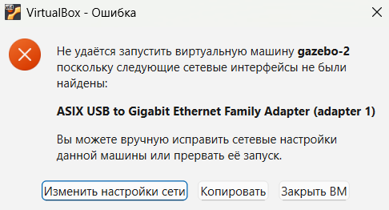
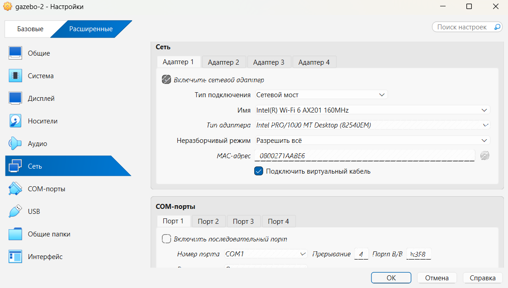
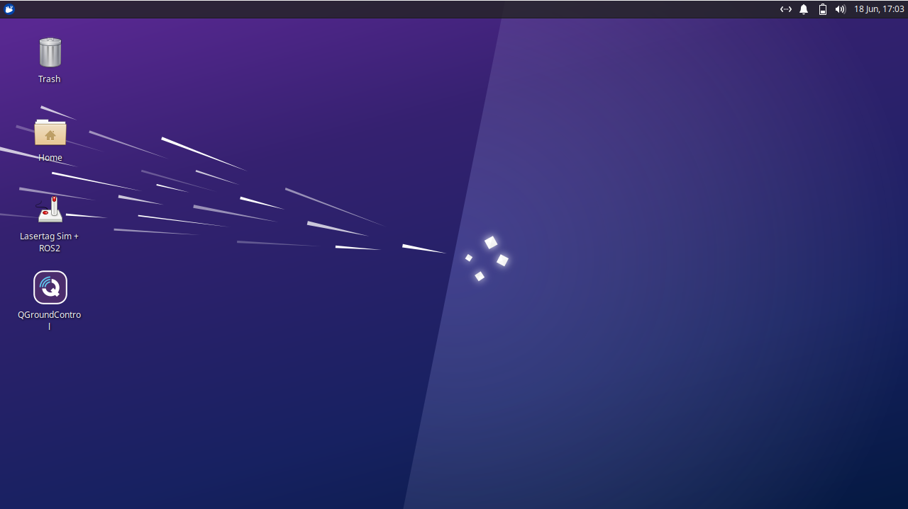
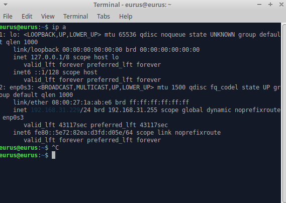
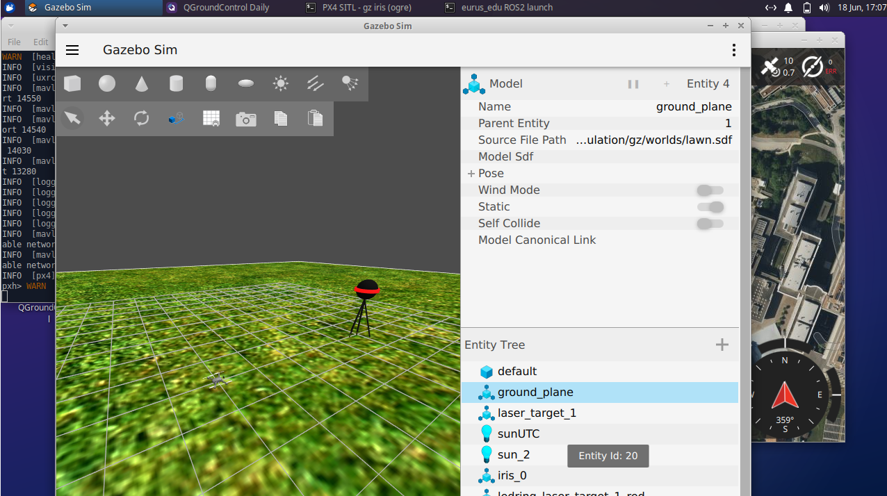
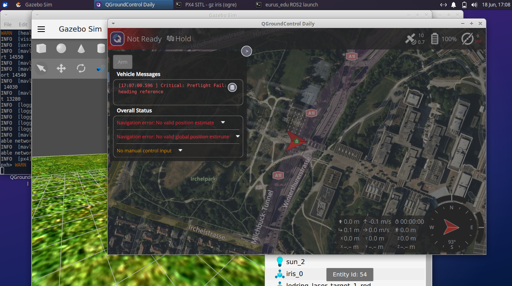
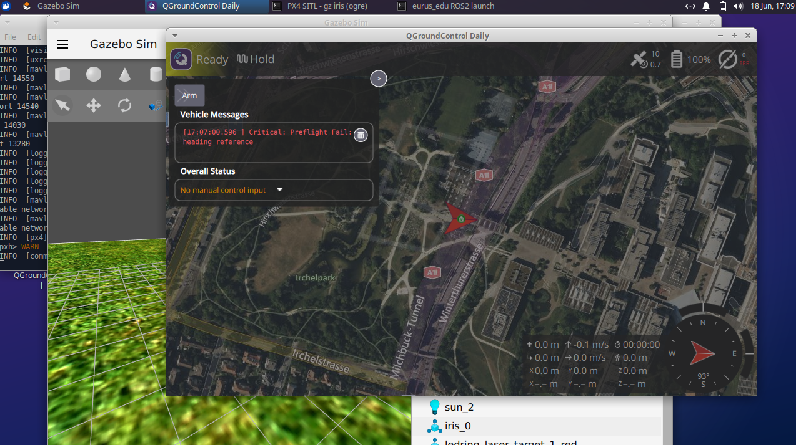

# Симулятор

Симулятор позволяет тестировать и отлаживать код в условиях, максимально приближенных к реальному полету:

- Полная совместимость: код использует тот же ROS2, что и физический дрон

- Реалистичность: симулятор использует виртуальную среду для симуляции полета PX4 SITL и поддерживает большинство функций настоящего аппарата

## Аппаратные требования

CPU - 8 ядер (intel i5 13th / ryzen 7 5000 series)

RAM - 16ГБ

50 гб свободной памяти

## Установка виртуальной машины

Для работы с симулятором необходимо установить и запустить на своём устройстве [Oracle VirtualBox](https://www.virtualbox.org/wiki/Downloads)

Установите программу с официального сайта и разверните на ней [образ виртуальной машины](https://disk.yandex.ru/d/4tVH5i1zkaNgpw)

При запуске может возникать следующая ошибка:

Чтобы её устранить нажмите "Изменить настройки сети" и после открытия следующего окна просто согласитесь с изменениями, нажав "ОК"

После успешного запуска откроется окно рабочего стола VirtualBox

## Настройка виртуальной машины

Для тестирования своего кода на виртуальной машине сначала необходимо узнать IP устройства, для этого в окне рабочего стола VBox вызываем терминал `Ctrl + Alt + t` и вводим команду `ip a`, в строке inet написан IP устройства. На данный IP адрес нужно обращаться при запуске кода со своей машины

С рабочего стола запускаем приложения `Lasertag Sim + ROS2` и `QGroundControl`, ждём загрузки приложений

После успешной загрузки `Lasertag Sim + ROS2` мишень загорается красным

В `QGroundControl` может возникнуть ошибка `Navigation error`. Для её устранения дождитесь полной загрузки приложения

Симулятор готов к работе когда в окне `QGroundControl` нет критических ошибок

Для управления дроном необходимо использовать библиотеку [EurusEdu](api.md)

## Программирование

Разработка и тестирование кода для симулятора полностью аналогичны работе с реальным дроном. Для управления используется библиотека [EurusEdu](api.md).

### Ограничения симулятора

На данный момент в виртуальной среде не реализованы:

1. **Модуль нейросети** - функции компьютерного зрения и распознавания объектов недоступны

2. **LED-лента** - управление светодиодной подсветкой дрона не поддерживается
